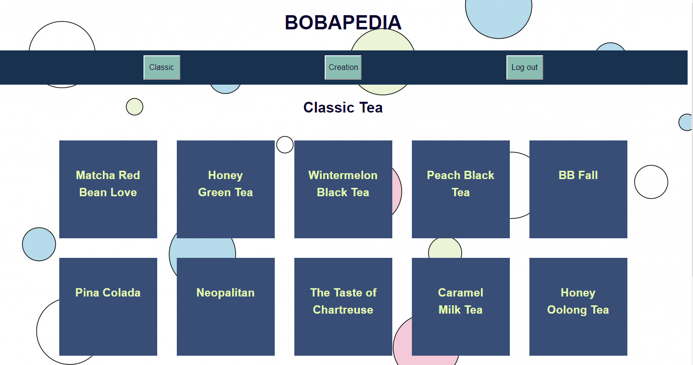
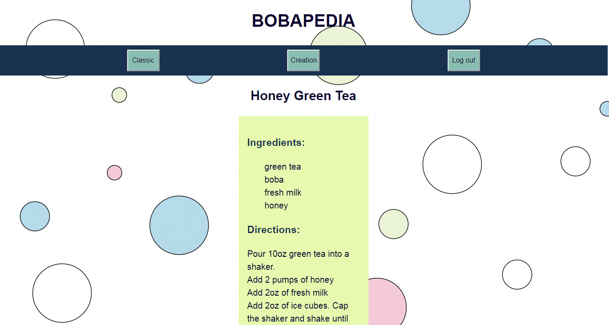

# Bobapedia API
This is the server used for the app Bobapedia

## Live Link: [Bobapedia](https://bobapedia-client.now.sh/)

## Client Repo Link: [Client Repo](https://github.com/jayelaguardia/bobapedia-client)

### Summary

Bobapedia is a collection of bubble (or boba) tea recipes. The Classic page is where you'll find the "top" 15 bubble teas. Clicking on one will direct you to the recipe to make that tea. The Creation page is where you can make your own tea recipe as well as view other teas made by other users. You can also update or delete the teas you have made. However, you must have an account to view or use this page. Please use the register tab to make an account or login if you've already made one.

### Tech Stacks

- Express
- Node.js
- PostgreSQL
- Mocha/Chai
- Heroku

## Screenshots
  The classic tea page where the "top" 15 teas are displayed
  
  After clicking on a tea, this recipe card will show with the correct fields to make that tea
  

## API Documentation

**Authentication**  
The endpoints related to creation tea are protected while the ones for classic, login, and registration are not. Simply register and login and you will have the authentication to access creation tea.

**Endpoints**
+ `/registration`
  - Accepts a json object of username and password and adds it into the user database  
+ `/login`
  - Accepts a json object of username and password
  - Responds with an auth token for the user's current logged in session  
+ `/classic`
  - get. Responds with an array of the "top" 15 tea objects with their fields  
+ `/classic/:classicID`
  - get. Responds with one specific classicc tea object with its corresponding fields  
+ `/creation`
  - get. Responds with an array of all user created tea objects and its fields. Authentication required
  - post. Accepts a json tea object with every field name required. Null values okay. Adds the tea object into the creation tea database. Authentication required. Responds with 201 if successful  
+ `/creation/:creationID`
  - get. Responds with one specific creation tea object with its corresponding fields. Authentication required
  - delete. Responds with 204 if successful. Authentication required
  - patch. Accepts a json tea object with every updated field required. Authentication required. Responds with 204 if successful

## Scripts

Start the application `npm start`

Start nodemon for the application `npm run dev`

Run the tests `npm test`

## Deploying

When your new project is ready for deployment, add a new Heroku application with `heroku create`. This will make a new git remote called "heroku" and you can then `npm run deploy` which will push to this remote's master branch.
